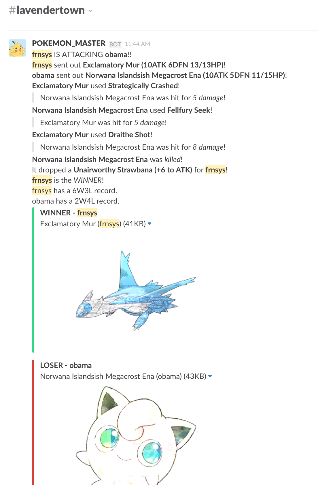

For simplicity, this just runs off of `sqlite`.

## Setup

### Pillow

`Pillow` (for generating the creature images) has a few prerequisites -

- on OSX: `brew install libtiff libjpeg webp little-cms2`
- on Ubuntu 14.04: `sudo apt-get install libtiff5-dev libjpeg8-dev zlib1g-dev libfreetype6-dev liblcms2-dev libwebp-dev tcl8.6-dev tk8.6-dev python-tk`

### Config

Copy the `config-sample.py` to `config.py` and add the following values:

- Slack Webhook URL (see below for more info)
- imgur client ID (sign up at [imgur.com](https://imgur.com))
- API key from [freeimages.pictures](http://freeimages.pictures/api)

### Database

To setup the database, run the following from a Python interpreter:

    from saltbeef import db
    db.create_all()

### Hosting

Example `nginx` and `supervisor` config scripts are in the `setup` folder.

### Slack

You can then go to your Slack team's integration page and:

1. Add an Incoming Webhook. Get the URL Slack provides and add it in the `config.py` file (see `config-sample.py` for the format).
2. Add a Slash Command. For instance, `/saltbeef`, and point it to the root of the app. For instance, if you're hosting it at `saltbeef.myserver.com`, point the slash command to `saltbeef.myserver.com/`.

Then from within the Slack channel you setup, you can run `/saltbeef help` to see a list of available commands.

## Usage

The following commands are available:
- `battle <username>` - fight a user
- `items` - list your items
- `equip <item #>` equip an item for the next battle (one-time use)
- `creatures` - list your creatures
- `ichoose <creature #>` - choose a creature for your next battle
- `capture` - catch a new creature
- `leaderboard` - view the best trainers

## To Do

- add in experience/leveling up/_EVOLUTION_??
- add in types and strengths/weaknesses??
